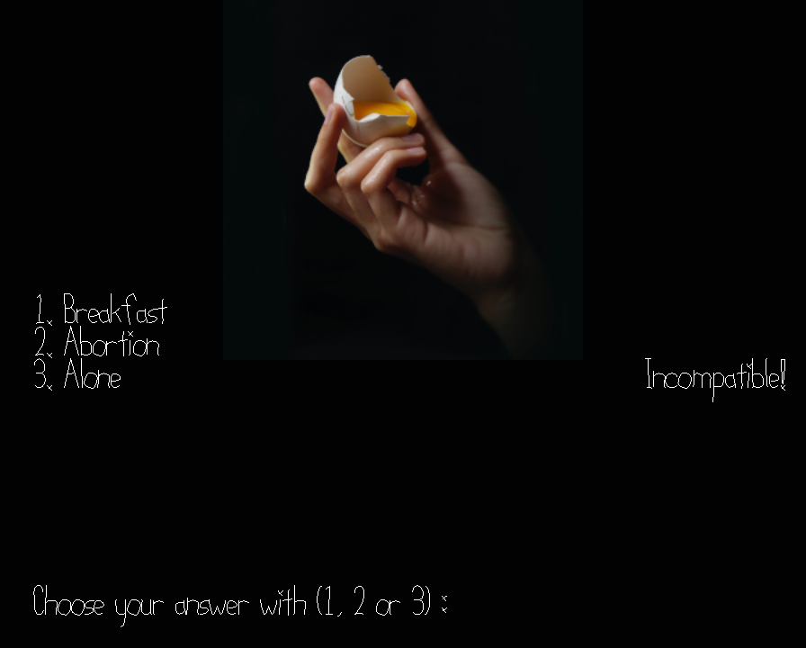

# What's on my mind?

Author: Pavan Paravasthu

Design: This is a 2 player, couples game show in which there are multiple rounds where the players guess what is on the other player's mind when they see a particular image.

Networking: 
PlayMode.cpp implements most of the client functionality including input processing and updating the graphics.
server.cpp has the gameplay logic with ample servings of spaghetti.

Screen Shot:

How To Play:

The game keeps showing different abstract art images with 3 options. If they both choose the same option, it shows they are compatible. If not, well, incompatible. The player uses the alphanumeric 1, 2 or 3 keys to choose options.

Sources: 
Images downloaded from https://unsplash.com
License URL : https://unsplash.com/license
Each image has the author URL to show attribution.
(banister) Ricardo Gomez Angel - https://unsplash.com/@ripato?utm_source=unsplash&amp;utm_medium=referral&amp;utm_content=creditCopyText
(egg) Miguel Andrade - https://unsplash.com/@miguel_pembo?utm_source=unsplash&utm_medium=referral&utm_content=creditCopyText
(flag-dessert) Valentina Perez - https://unsplash.com/@ovalentinaperez?utm_source=unsplash&utm_medium=referral&utm_content=creditCopyText

Sounds:
(BGM)
Happy Happy Game Show by Kevin MacLeod
Link: https://incompetech.filmmusic.io/song/3856-happy-happy-game-show
License: http://creativecommons.org/licenses/by/4.0/

This game was built with [NEST](NEST.md).

